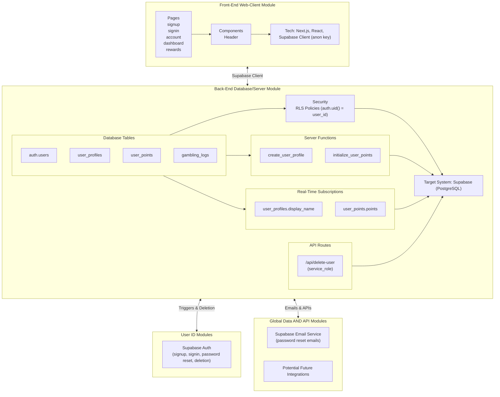

# Architecture Documentation - GambLogic

## Overview

The **GambLogic** app is designed to help users track their gambling activities responsibly, generate tax reports, and earn rewards for responsible behavior. The app aims to promote awareness and accountability through features like session logging, tax reporting, and a rewards system.

### Technology Stack
- **Front-End**: Next.js (React framework) for server-side rendering and routing, React for building UI components.
- **Back-End/Database**: Supabase (PostgreSQL) for user authentication, data storage, and real-time subscriptions.
- **Styling**: Tailwind CSS for utility-first styling, ensuring rapid UI development and consistency.
- **State Management**: React’s `useState` and `useEffect` for local component state and side effects.

## Directory Structure

The frontend codebase is organized using Next.js conventions, ensuring modularity and scalability.

- **`/app`**: Contains Next.js pages and API routes.
    - `signup/page.js`: User registration page.
    - `signin/page.js`: User login page.
    - `account/page.js`: User profile management (update username, reset password, delete account).
    - `dashboard/page.js`: Main dashboard with links to features.
    - `rewards/page.js`: Rewards system (e.g., wheel spin to deduct points).
    - `support/page.js`: Support page.
    - `privacy/page.js`: Privacy policy page.
    - `tax-report/page.js`: Tax report page.
    - `terms/page.js`: Terms of service page.
    - `api/delete-user/route.js`: API route to delete users from `auth.users` using Supabase Admin API.
- **`/components`**: Reusable React components.
    - `Header.js`: Navigation bar with real-time points and username display.
- **`/lib`**: Utility functions and configurations.
    - `supabase.js`: Initializes the Supabase client with anon key for client-side queries.
- **`/styles`**: Global styles and Tailwind CSS configuration.
    - `globals.css`: Imports Tailwind directives and custom styles (e.g., Font Awesome for icons).
- **`/docs`**: Documentation files.
    - `architecture.md`: This document.

## Key Components/Modules

The app is divided into several key modules:

- **Authentication Flow**:
  - Handles user signup, signin, password reset, and account deletion.
  - Uses Supabase Auth for secure user management.
- **Dashboard Components**:
  - Central hub (`dashboard/page.js`) linking to features: Diary, Tax Report, Rewards, Account, Support.
  - Displays a welcome message with the user’s `display_name` (or email prefix).
- **Session Logging Form** (Placeholder):
  - Planned for `/diary` page to log gambling sessions.
  - Will update `user_points` (+20 points per log) and store session data.
- **Reporting Module** (Placeholder):
  - Planned for `/tax-report` page to generate tax reports based on session data.
- **Rewards Module**:
  - `/rewards` page with a wheel spin feature (deducts points per spin).
  - Real-time points updates in `Header.js`.

## Data Flow

Data flows through the app in a clear, unidirectional manner:

1. **User Interaction**: The user interacts with a page (e.g., submits a form on `/account` to update their username).
2. **React Component**: The component (e.g., `Account` in `account/page.js`) captures the input and triggers a state update using `useState`.
3. **Supabase Client**: The component uses the Supabase client (from `/lib/supabase.js`) to send a query (e.g., `supabase.from("user_profiles").upsert(...)`).
4. **Supabase Database**: The database processes the query, applying RLS policies (e.g., `auth.uid() = user_id`), and updates the `user_profiles` table.
5. **Real-Time Subscription**: A subscription (e.g., in `Header.js`) listens for changes to `user_profiles.display_name` and updates the UI in real-time.
6. **Back to Component**: The updated data is reflected in the UI (e.g., `Header` and `dashboard` show the new username).

## State Management

- **Approach**: The app uses React’s built-in `useState` and `useEffect` hooks for state management.
  - **Local State**: Each component manages its own state (e.g., `user`, `displayName`, `points` in `Header.js` and `account/page.js`).
  - **Side Effects**: `useEffect` handles API calls (e.g., fetching user data, setting up real-time subscriptions).
- **Real-Time Updates**: Supabase real-time subscriptions update state in components like `Header` and `dashboard` (e.g., `user_profiles.display_name`, `user_points.points`).
- **Rationale**: Given the app’s simplicity and lack of complex global state, `useState` and `useEffect` are sufficient. 

## Authentication

The app uses **Supabase Auth** for a secure and seamless authentication flow:

1. **Signup** (`signup/page.js`):
   - User submits email, password, and optional username.
   - `supabase.auth.signUp` creates a user in `auth.users`.
   - Trigger `initialize_user_points` sets `user_points.points = 50`.
   - Function `create_user_profile` creates a `user_profiles` row with `display_name` and `email_notifications`.
   - Supabase sends a confirmation email (unless disabled for testing).
2. **Signin** (`signin/page.js`):
   - User submits email and password.
   - `supabase.auth.signInWithPassword` authenticates the user.
   - Redirects to `/dashboard`.
3. **Password Reset** (`account/page.js`):
   - User clicks “Reset Password”.
   - `supabase.auth.resetPasswordForEmail` sends a reset email with a link to `/reset-password` (placeholder page).
4. **Delete Account** (`account/page.js`):
   - User clicks “Delete Account” and confirms.
   - Calls `/api/delete-user` to delete the user from `auth.users` (using `service_role` key).
   - `ON DELETE CASCADE` removes `user_profiles` and `user_points`.
   - `supabase.auth.signOut` logs the user out, redirects to `/`.

## Database Schema

The app uses Supabase (PostgreSQL) with the following main tables:

- **`auth.users`** (managed by Supabase Auth):
  - `id` (UUID, PK): Unique user ID.
  - `email` (TEXT): User’s email.
  - `created_at` (TIMESTAMP): When the user was created.
- **`user_profiles`**:
  - `user_id` (UUID, PK, FK → `auth.users(id)` ON DELETE CASCADE): Links to the user.
  - `display_name` (TEXT, nullable): Optional username.
  - `email_notifications` (BOOLEAN, default TRUE): Whether to receive emails.
  - `created_at`, `updated_at` (TIMESTAMP WITH TIME ZONE): Timestamps.
- **`user_points`**:
  - `user_id` (UUID, PK, FK → `auth.users(id)` ON DELETE CASCADE): Links to the user.
  - `points` (INTEGER, default 0): Points for rewards.
  - `updated_at` (TIMESTAMP WITH TIME ZONE): Last updated. 
- **`gambling_logs`**:
    - `user_id` (UUID): User ID.
    - `type` (TEXT): Type of gambling activity.
    - `locationCategory` (TEXT): Category of the location.
    - `specificLocation` (TEXT): Specific location details.
    - `amount` (INT8): Amount involved.
    - `result` (TEXT): Outcome of the activity.
    - `id` (INT8, PK): Unique log ID.
    - `timestamp` (TIMESTAMPTZ): Timestamp of the log entry.

### Relationships
- `user_profiles.user_id` → `auth.users.id` (1:1, CASCADE).
- `user_points.user_id` → `auth.users.id` (1:1, CASCADE).
- `gambling_logs.user_id` → `auth.users.id` (1:many, CASCADE).

## Key Design Decisions (Rationale)

- **Next.js**:
  - **Why**: Chosen for its server-side rendering (SSR) and static site generation (SSG) capabilities, improving SEO and performance. The file-based routing simplifies page creation (e.g., `/app/dashboard/page.js` → `/dashboard`).
  - **Benefit**: Streamlines development with built-in API routes (e.g., `/api/delete-user`) and Vercel deployment.
- **Supabase**:
  - **Why**: Selected for its ease of use as a Firebase alternative, providing authentication, a PostgreSQL database, and real-time subscriptions out of the box.
  - **Benefit**: Simplifies user management (`auth.users`), real-time updates (e.g., `display_name`, `points`), and database operations with RLS for security.
- **Tailwind CSS**:
  - **Why**: Adopted for rapid UI development using utility-first classes, ensuring consistency without writing custom CSS.
  - **Benefit**: Speeds up styling (e.g., `bg-gray-50`, `blue-600`, `rounded-2xl`) and maintains a clean, responsive design.

## Environment Variables

### Location

- Contact one of the devs...

### Variables

- **`NEXT_PUBLIC_SUPABASE_URL`**:
  - **Purpose**: The URL of the Supabase project (e.g., `https://your-project.supabase.co`).
  - **Required**: Development and production.
  - **Source**: Supabase Dashboard > Settings > API > Project URL.
- **`NEXT_PUBLIC_SUPABASE_ANON_KEY`**:
  - **Purpose**: The public anon key for client-side Supabase queries.
  - **Required**: Development and production.
  - **Source**: Supabase Dashboard > Settings > API > anon public.
- **`SUPABASE_SERVICE_ROLE_KEY`**:
  - **Purpose**: The service role key for server-side admin actions (e.g., `/api/delete-user`).
  - **Required**: Production (optional in development if admin actions are mocked).
  - **Source**: Supabase Dashboard > Settings > API > service_role secret.
  - **Note**: Keep this secret; do not expose in client-side code.

## Diagrams

### Component Hierarchy Diagram (Data Flow) 

